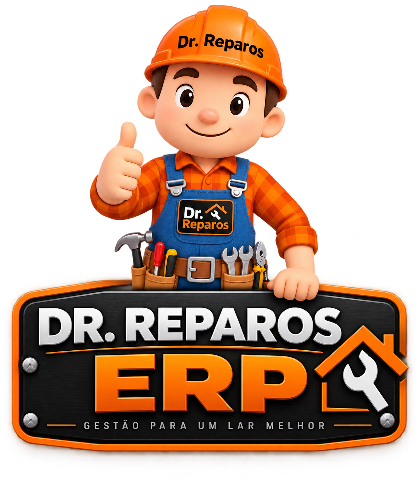

<div align="center">



# 🔧 DR Reparos ERP

### Sistema de gestão para manutenção residencial

**Uma solução desenvolvida a partir das necessidades reais da DR Reparos.**


**Status: Em desenvolvimento | Aplicação implantada na nuvem**

</div>

---

## 📖 Sobre o projeto

O DR Reparos ERP é um sistema web que estou desenvolvendo para administrar minha própria empresa de manutenção residencial.

O projeto surgiu da necessidade de substituir controles manuais por uma aplicação que centralize clientes, orçamentos, ordens de serviço, materiais e informações financeiras.

Mais do que um projeto acadêmico, o ERP está sendo construído para atender às necessidades de uma operação comercial existente.

Seu desenvolvimento envolve a aplicação prática de conhecimentos de programação, banco de dados, desenvolvimento web e infraestrutura em nuvem.

---

## 🎯 Objetivos

- Centralizar o cadastro dos clientes.
- Organizar os orçamentos e serviços.
- Acompanhar o faturamento da empresa.
- Controlar custos e despesas.
- Gerenciar materiais e estoque.
- Facilitar a tomada de decisões.
- Disponibilizar o sistema pelo celular e computador.

---

## 💻 Tecnologias utilizadas

| Tecnologia | Finalidade |
|---|---|
| Python | Linguagem principal |
| Flask | Desenvolvimento do back-end |
| HTML / CSS | Interface da aplicação |
| PostgreSQL | Banco de dados relacional |
| Neon | Hospedagem do banco de dados |
| Render | Hospedagem da aplicação |
| Git | Controle de versões |
| GitHub | Repositório e documentação |

---

## 🏗️ Arquitetura

A aplicação utiliza Python e Flask no back-end, com páginas HTML e CSS e persistência de dados em PostgreSQL.

```text
           USUÁRIO
              |
       COMPUTADOR / CELULAR
              |
              v
         INTERFACE WEB
          HTML + CSS
              |
              v
         PYTHON / FLASK
              |
              v
      REGRAS DE NEGÓCIO
              |
              v
         POSTGRESQL
            NEON
```

A aplicação é hospedada no Render e utiliza o Neon como serviço de banco de dados.

---

## ⚙️ Módulos do ERP

### 📊 Dashboard

Painel desenvolvido para acompanhar indicadores operacionais e financeiros da empresa.

Entre os indicadores contemplados pelo projeto estão:

- Faturamento.
- Despesas.
- Resultado financeiro.
- Ticket médio.
- Metas de faturamento.
- Conversão de orçamentos.

### 👥 Clientes

Módulo de cadastro e consulta de clientes, permitindo organizar informações de contato e relacioná-las aos atendimentos.

O cadastro já foi implementado e testado.

### 📝 Orçamentos

Módulo para organizar propostas comerciais, incluindo serviços, materiais e valores.

O projeto contempla o acompanhamento da aprovação dos orçamentos e sua relação com as ordens de serviço.

### 🔧 Ordens de serviço

Estrutura para organizar a execução dos serviços, incluindo agendamentos e vínculos com os orçamentos.

### 📦 Estoque

Estrutura destinada ao cadastro e controle dos materiais utilizados pela empresa, incluindo quantidades, custos e estoque mínimo.

### 💰 Financeiro

Estruturas para acompanhar pagamentos, despesas, custos operacionais e metas da empresa.

Os módulos estão em diferentes estágios de implementação e validação.

---

## 🔄 Fluxo operacional

O ERP foi concebido para acompanhar o ciclo de atendimento da DR Reparos:

1. Cadastro do cliente.
2. Elaboração do orçamento.
3. Aprovação da proposta.
4. Abertura e acompanhamento da ordem de serviço.
5. Execução do atendimento.
6. Registro financeiro.
7. Acompanhamento dos indicadores.

Esse fluxo orienta o desenvolvimento e a integração dos módulos do sistema.

---

## ☁️ Infraestrutura e deploy

O projeto está hospedado na nuvem utilizando o Render.

O banco de dados PostgreSQL utiliza a infraestrutura do Neon, permitindo manter os dados separados da instância de execução da aplicação.

Durante o desenvolvimento, foram realizados testes de acesso pelo computador e pelo celular.

---

## 🧪 Testes com dados reais

A próxima etapa é cadastrar os clientes existentes e registrar serviços reais da DR Reparos.

O objetivo é testar os módulos com informações da operação, verificar os cálculos e identificar melhorias antes de ampliar a utilização do sistema.

---

## 📸 Demonstração

As capturas de tela serão adicionadas conforme a documentação dos módulos.

### Dashboard

*Captura de tela em preparação.*

### Cadastro de clientes

*Captura de tela em preparação.*

### Orçamentos e serviços

*Capturas de tela em preparação.*

---

## 🧠 Desafios e aprendizados

Durante o desenvolvimento, trabalhei com:

- Construção de aplicações web utilizando Flask.
- Organização de rotas e regras de negócio.
- Modelagem e persistência de dados.
- Configuração de banco PostgreSQL na nuvem.
- Implantação da aplicação no Render.
- Testes de acesso pelo celular.
- Versionamento e publicação no GitHub.
- Desenvolvimento orientado a problemas reais.

A experiência também envolve compreender os requisitos da empresa e transformá-los em funcionalidades de software.

---

## 🚀 Próximas etapas

- Cadastrar clientes e serviços reais.
- Ampliar os testes dos módulos.
- Evoluir os fluxos de orçamentos e ordens de serviço.
- Aprimorar o controle financeiro.
- Desenvolver relatórios gerenciais.
- Melhorar a experiência de utilização pelo celular.
- Ampliar a documentação técnica.

---

## 📂 Estrutura do repositório

```text
DR-Reparos-ERP/
|
|-- static/
|-- templates/
|-- app.py
|-- importar_dados.py
|-- requirements.txt
|-- .gitignore
|-- logo-erp.png
|-- README.md
```

---

## 👨‍💻 Desenvolvedor

**Wellington Liviz**

Estudante de Tecnologia em Inteligência Artificial, com três semestres cursados de Análise e Desenvolvimento de Sistemas e experiência profissional em operações de TI no setor bancário.

Desenvolvo projetos que conectam conhecimentos técnicos à resolução de problemas reais.

[Meu GitHub](https://github.com/wellingtonliviz-a11y)

---

<div align="center">

### 🔧 DR Reparos ERP

**Tecnologia aplicada à gestão de uma empresa real.**

Desenvolvido por Wellington Liviz.

</div>
