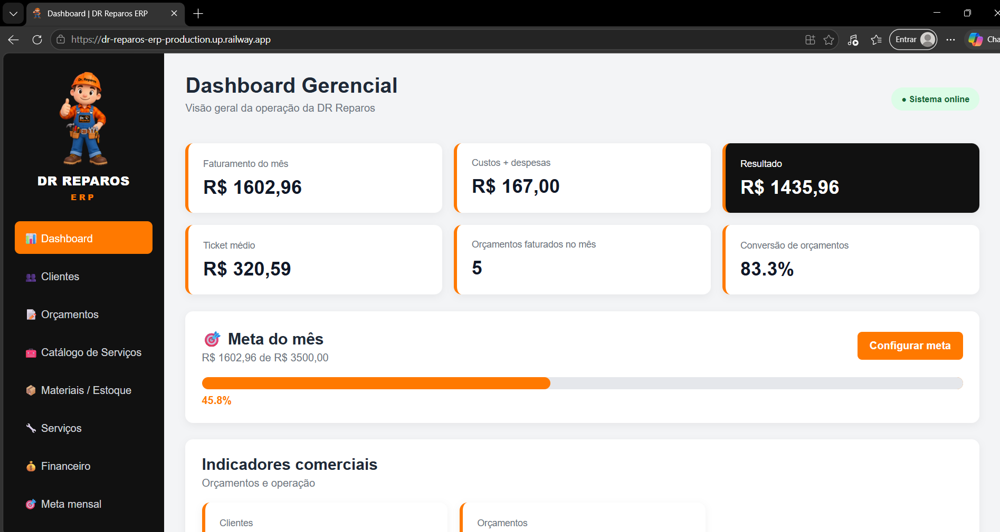
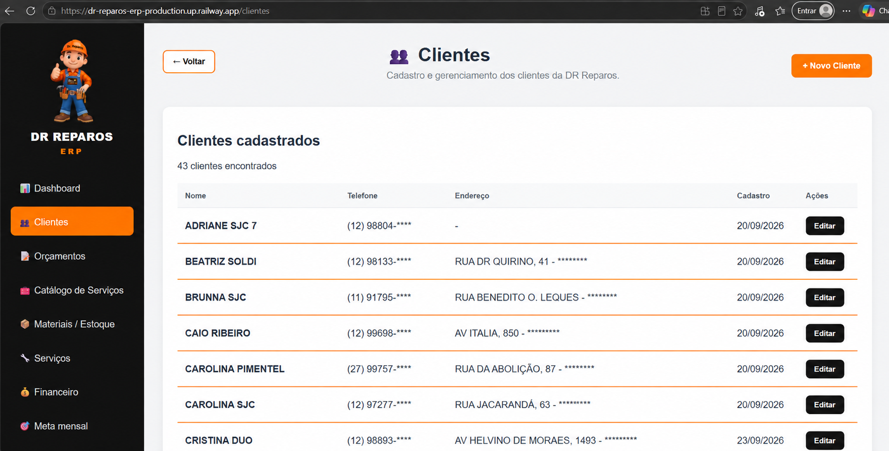
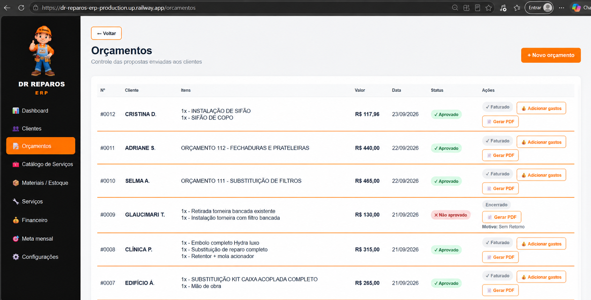
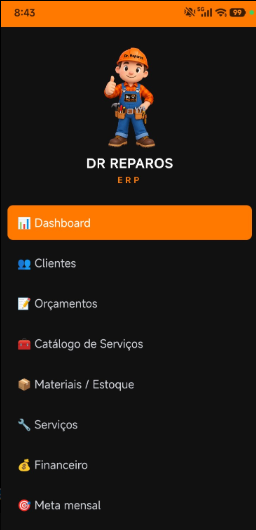

<div align="center">


# 🔧 DR Reparos ERP

### Sistema de gestão para manutenção residencial

**Tecnologia aplicada à gestão de uma empresa real.**


**Status: Em desenvolvimento | Aplicação publicada na nuvem**

</div>

---

## 📖 Sobre o projeto

O DR Reparos ERP é um sistema web desenvolvido para administrar minha própria empresa de manutenção residencial.

O projeto surgiu da necessidade de substituir controles manuais por uma aplicação que centralizasse clientes, orçamentos, serviços e informações financeiras.

Mais do que um exercício acadêmico, o sistema está sendo construído para atender às necessidades de uma empresa em operação.

---

## 🎯 Objetivos

- Centralizar o cadastro dos clientes.
- Organizar os orçamentos e serviços.
- Acompanhar o faturamento da empresa.
- Controlar custos e despesas.
- Facilitar a tomada de decisões.
- Disponibilizar o sistema pelo computador e celular.
- Evoluir o controle de materiais e estoque.

---

## 💻 Tecnologias utilizadas

| Tecnologia | Finalidade |
|---|---|
| Python | Linguagem principal |
| Flask | Desenvolvimento do back-end |
| HTML / CSS | Interface web |
| PostgreSQL | Banco de dados relacional |
| Neon | Hospedagem do banco de dados |
| Railway | Hospedagem da aplicação |
| Git | Controle de versões |
| GitHub | Repositório e documentação |
| VS Code | Ambiente de desenvolvimento |

---

## 🏗️ Arquitetura

O ERP utiliza Python e Flask no back-end, páginas HTML e CSS na interface e PostgreSQL para persistência dos dados.

```text
           USUÁRIO
              |
     COMPUTADOR / CELULAR
              |
              v
        INTERFACE WEB
          HTML + CSS
              |
              v
         PYTHON / FLASK
              |
              v
      REGRAS DE NEGÓCIO
              |
              v
         POSTGRESQL
            NEON

Aplicação hospedada no Railway
```

O código é versionado no GitHub e a aplicação é publicada no Railway, utilizando o Neon como serviço de banco de dados.

---

## ⚙️ Módulos do ERP

### 📊 Dashboard

Painel para acompanhar informações operacionais e financeiras, incluindo:

- Indicadores de faturamento.
- Custos e despesas.
- Orçamentos faturados no mês.
- Acompanhamento dos resultados da empresa.

### 👥 Clientes

Cadastro e gerenciamento de clientes, com informações de contato para organizar os atendimentos.

### 📝 Orçamentos

Módulo para elaboração e acompanhamento de propostas comerciais.

- Identificação do cliente.
- Descrição dos serviços e materiais.
- Valores dos orçamentos.
- Organização dos itens da proposta.
- Acompanhamento dos orçamentos.

### 🔧 Serviços

Organização dos atendimentos e serviços realizados pela empresa.

### 💰 Financeiro

Acompanhamento dos custos e despesas relacionados à operação, com informações integradas ao dashboard.

### 📦 Estoque

Módulo previsto para evolução do controle de materiais, quantidades e custos.

---

## 📸 Telas do sistema

As imagens abaixo documentam a interface e as funcionalidades do ERP.

### 1. Dashboard

Visão geral dos indicadores operacionais e financeiros.



### 2. Cadastro de clientes

Cadastro e consulta dos clientes da empresa.



### 3. Orçamentos

Elaboração e acompanhamento dos orçamentos.



### 4. Serviços

Organização dos serviços e atendimentos.


### 5. Custos e despesas

Controle dos gastos operacionais.


### 6. Acesso pelo celular

Interface do ERP acessada pelo navegador do celular.



---

## 🔄 Fluxo operacional

O sistema foi concebido para acompanhar o atendimento da DR Reparos:

1. Cadastro do cliente.
2. Elaboração do orçamento.
3. Aprovação da proposta.
4. Organização e execução do serviço.
5. Registro de custos e despesas.
6. Acompanhamento dos indicadores.

Os módulos continuam sendo integrados e aprimorados conforme as necessidades da empresa.

---

## ☁️ Infraestrutura e deploy

A aplicação está hospedada no **Railway**, com banco de dados **PostgreSQL no Neon**.

O projeto utiliza Git e GitHub para controle de versões e publicação de alterações.

O sistema também foi testado pelo celular, permitindo acessar suas funcionalidades fora do computador.

---

## 🧠 Desafios e aprendizados

Durante o desenvolvimento do ERP, trabalhei com:

- Desenvolvimento de aplicações web com Python e Flask.
- Organização de rotas e regras de negócio.
- Integração com banco de dados PostgreSQL.
- Configuração do banco na nuvem utilizando Neon.
- Publicação e atualização da aplicação no Railway.
- Versionamento com Git e GitHub.
- Correção de problemas identificados durante os testes.
- Adaptação da interface para acesso pelo celular.
- Desenvolvimento de funcionalidades a partir de necessidades reais da empresa.

---

## 🚀 Próximas etapas

- Ampliar os testes com dados reais.
- Aprimorar os fluxos de orçamentos e serviços.
- Evoluir o controle financeiro.
- Desenvolver relatórios gerenciais.
- Implementar e integrar o controle de estoque.
- Melhorar continuamente a experiência pelo celular.
- Ampliar a documentação técnica.

---

## 👨‍💻 Desenvolvedor

**Wellington Liviz**

Estudante de Tecnologia em Inteligência Artificial, com três semestres cursados de Análise e Desenvolvimento de Sistemas e experiência profissional em operações de TI no setor bancário.

Desenvolvo projetos que conectam conhecimentos técnicos à resolução de problemas reais.

[Meu GitHub](https://github.com/wellingtonliviz-a11y)

---

<div align="center">

### 🔧 DR Reparos ERP

**Tecnologia aplicada à gestão de uma empresa real.**

Desenvolvido por Wellington Liviz.

</div>